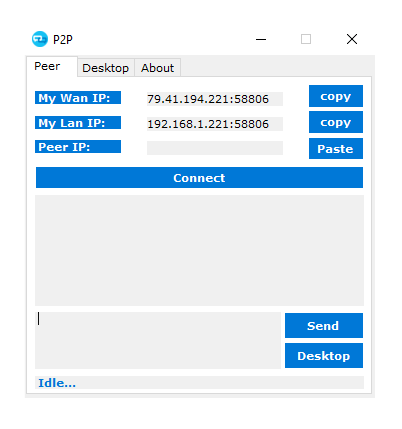
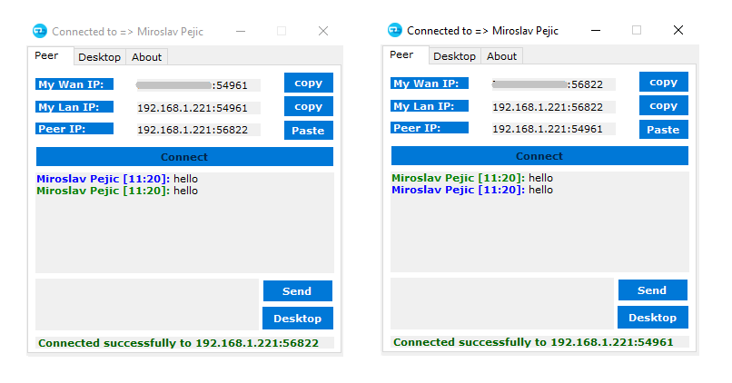
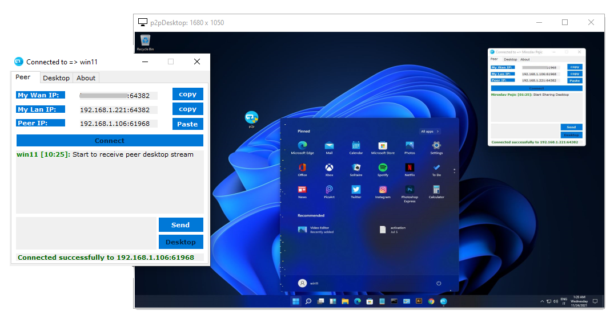

  

# 
P2P Remote Desktop

Remote Desktop P2P based - Portable, No Configuration or Installation Needed.

## How it works

- Compile and Open `p2p.exe` as admin in 2 different PC's.

- Copy the `My Lan or Wan IP` and communicate it to other peer and vice versa.

- The 2 peers have now the 2 endpoint to connect to, so press on both `Connect`.
- The 2 peers now are able to `sent messages` or take the `Remote Desktop Control` between them.

 

It's use [UDT protocol](https://en.wikipedia.org/wiki/UDP-based_Data_Transfer_Protocol)
and thanks to `rendezvous` connection, it should be able to `bypass most firewall rules`, like a small concept of `TeamViewer` at 0 cost!

## Note

The app doesn't have a `digital signature` being an open source project, it may be detected as a `false positive` by AVs. When you compile it from the source code, just add the project in the exception. Thank you for understanding.

## Contributing

Contributions are welcome and greatly appreciated!

## License

## Support

