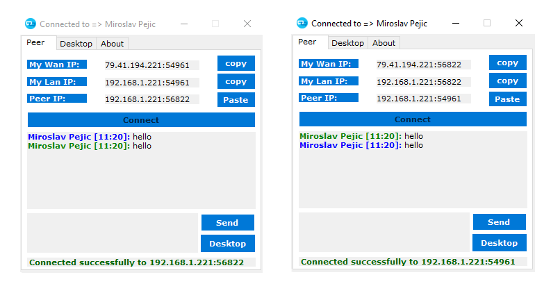
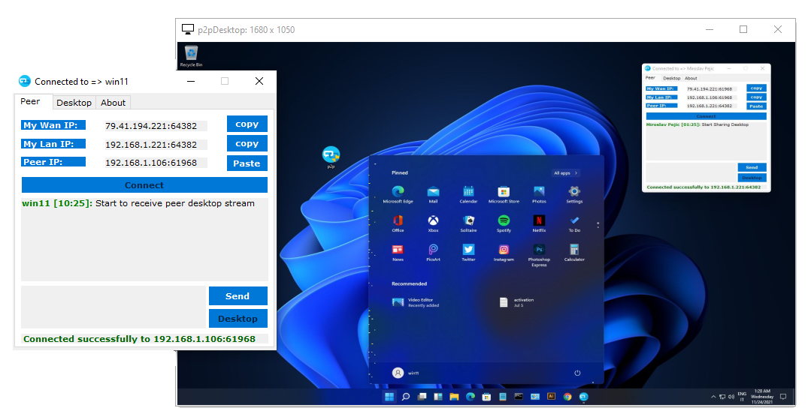
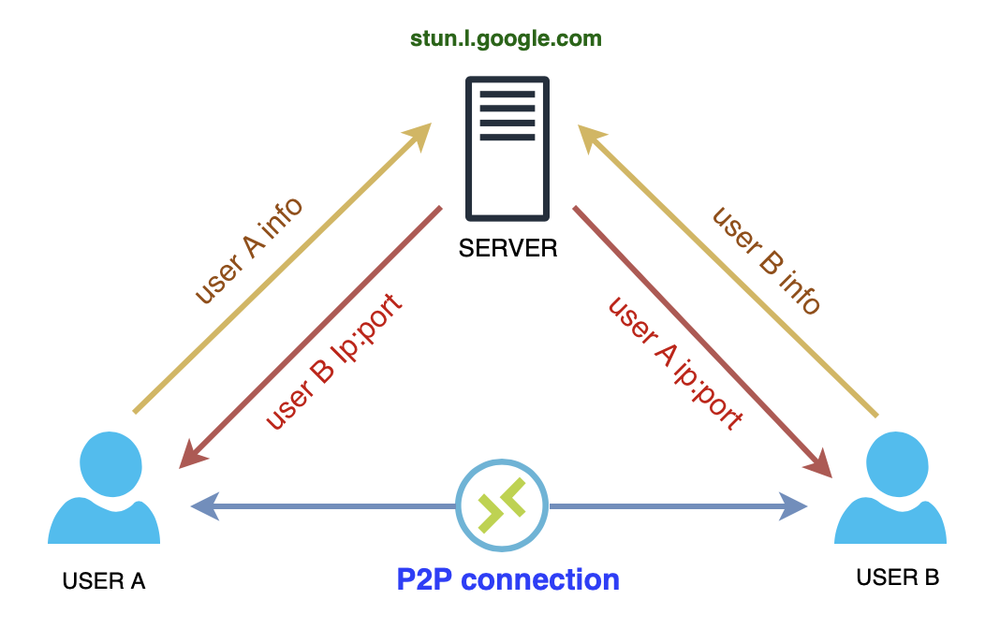

#  Remote Desktop P2P

`Remote Desktop` solution `P2P` based

## How it works

- Open [p2p.exe](p2pconn/bin/Release/p2p.exe) as admin in 2 different PC's

- Copy the `My Lan or Wan IP` and communicate it to other peer.

- So the 2 peers have now the 2 enpoint to connect to, so press on both `Connect`.

- The 2 peers now are able to `sent messages` or take the `Remote Desktop Control` between them.

 

It's use [UDT protocol](https://en.wikipedia.org/wiki/UDP-based_Data_Transfer_Protocol)
and thanks to `rendezvous` connection, it should be able to `bypass all firewall rules` etc, like a small concepts of `TeamViewer` at 0 cost!

 

## Contributing

Contributions are welcome and greatly appreciated!

## License

[MIT](LICENSE)
